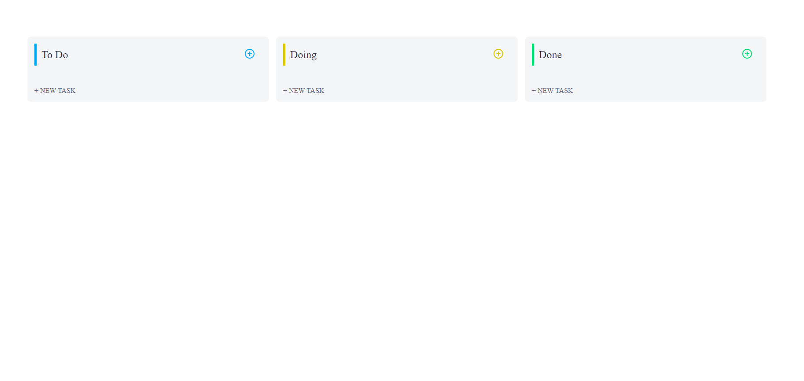

O projeto é um quadro Kanban com CRUD completo para que possa organizar as tasks. Talvez por esse ser o meu segundo contato com Vite, o dockerfile do front gera a imagem certo e roda o projeto mas sem acesso pelo localhost, talvez seja necessária uma configuração a mais.

## **:camera: Screenshot**



## Como utilizar

```bash
# Clone este repositório
$ git clone git@github.com:flammajl/kanban.git

# Acesse a pasta do projeto no terminal/cmd
$ cd kaban

# Acesse a pasta do backend
$ cd BACK

# Instale as dependências
$ yarn install | npm install

# Execute a API
$ yarn server | npm run server

# Em outro terminal acesse a pasta do frontend
$ cd FRONT

# Crie um arquivo .env.local e coloque as variáveis
# de ambiente baseado no arquivo .env.example

# Instale as dependências
$ yarn install | npm install

# Execute a aplicação em modo de desenvolvimento
$ yarn dev | npm run dev

# O servidor inciará na porta:3000 - acesse <http://localhost:3000>
```

Ou acesse o Demo: https://kanban-flammajl.vercel.app

## 📝 Licença

Este projeto está licenciado sob a Licença MIT. Veja o arquivo de [LICENÇA](https://github.com/flammajl/kanban/blob/master/LICENSE) para detalhes.
